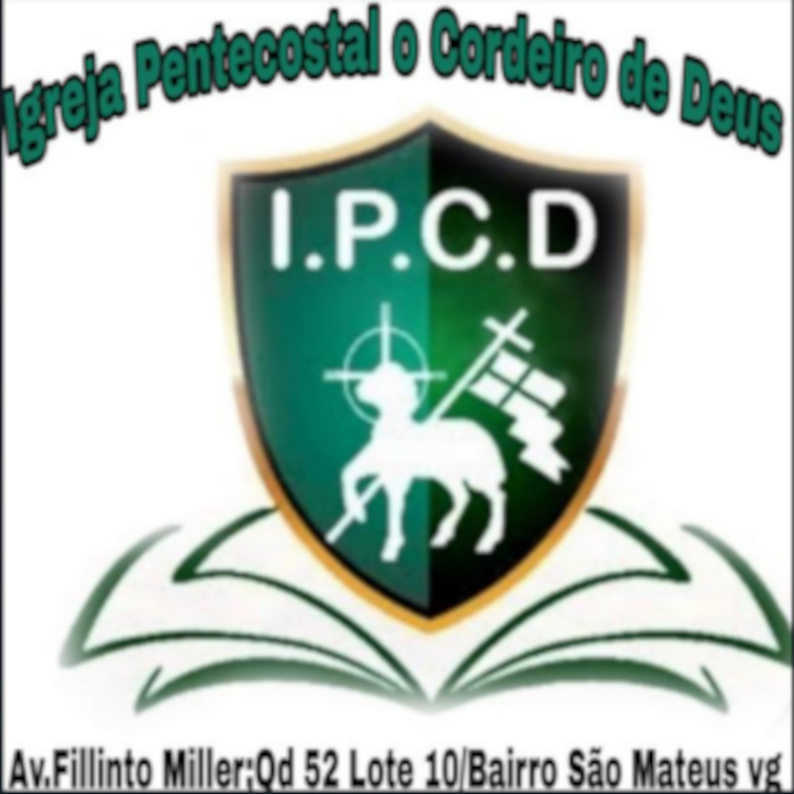

<h1 align="center"> Reinal</h1>

Programa exclusivo e gratuito, promovido por AMTec System para fins religiosos.

  <a href="#-tecnologias">Tecnologias</a>&nbsp;&nbsp;&nbsp;|&nbsp;&nbsp;&nbsp;
  <a href="#-projeto">Projeto</a>&nbsp;&nbsp;&nbsp;|&nbsp;&nbsp;&nbsp;
  <a href="#-layout">Layout</a>&nbsp;&nbsp;&nbsp;|&nbsp;&nbsp;&nbsp;
  <a href="#memo-licença">Licença</a>

  

 

  

## 🚀 Tecnologias

Esse projeto foi desenvolvido com as seguintes tecnologias:

- HTML e CSS
- Git e Github

## 💻 Projeto

Este projeto inicial de um site voltado para áreas de principios cristão.

## 🔖 Layout

Você pode visualizar o layout do projeto através [DESSE LINK](). É necessário ter conta no [Figma]() para acessá-lo.

## :memo: Licença

Esse projeto não está sob a licença MIT.

---

Feito para by Igreja Pentecostal O Cordeiro de Deus